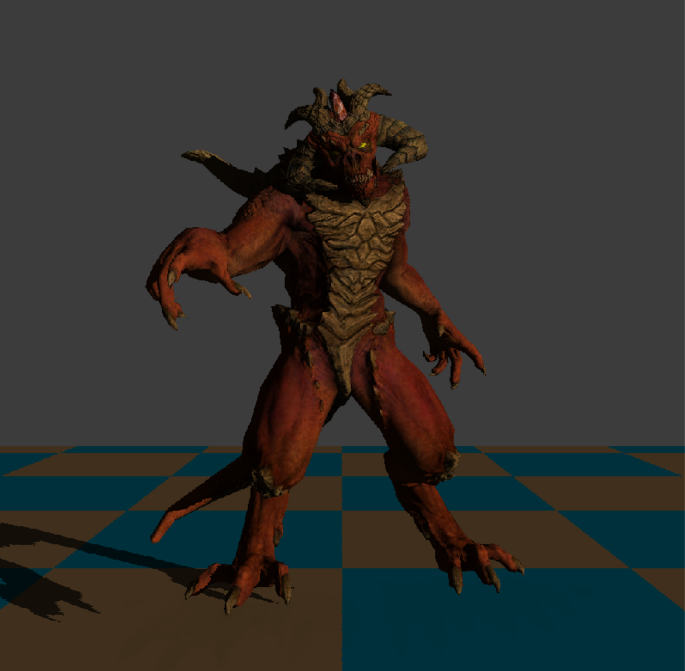

# swrender

A CPU software rasterizer written in C++. No GPU — every stage of the pipeline runs on the CPU.



## Features

- Perspective-correct attribute interpolation
- Sutherland-Hodgman frustum clipping
- Blinn-Phong shading with diffuse, specular, and normal maps
- Shadow mapping (orthographic light, depth bias)
- Screen-space ambient occlusion (SSAO) with box blur
- Interactive camera — orbit, pan, zoom

## Building

Requires CMake 3.8+ and a C++20 compiler. SDL2 and SDL2_ttf are fetched automatically via CMake FetchContent.

```bash
cmake -S . -B build
cmake --build build --config Release
```
